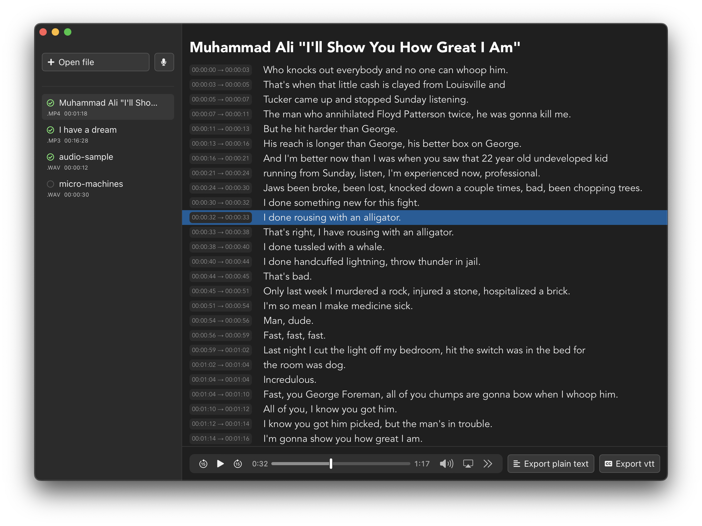

# Whiskey
Whiskey is a GUI for Open AI's [Whisper](https://openai.com/blog/whisper/) built using Tauri and Sveltekit.
Using cpp binaries for Whisper from [whisper.cpp](https://github.com/ggerganov/whisper.cpp)

## Features
- Transcribe audio or video files into written text
- Real-time text highlighting during playback
- Export transcriptions as .txt or .vtt files

## Planned features: 
- [x] Export files 
- [x] Rename files 
- [x] Save already opened files
- [x] Upload more than wav files
- [x] Upload video
- [x] Drag and drop
- [x] Start audio playback from line
- [ ] Record mic audio directly
- [ ] Apple Silicon, Linux, and Windows binaries
- [ ] Editable text 
- [ ] Event and errors show in UI 
- [ ] Prediction accuracy 
